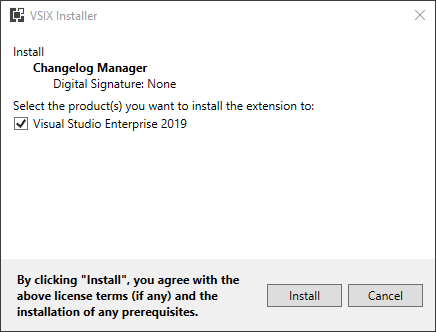
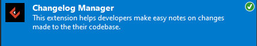
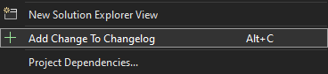
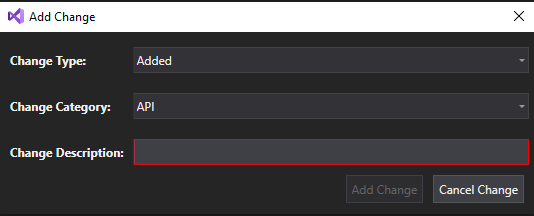
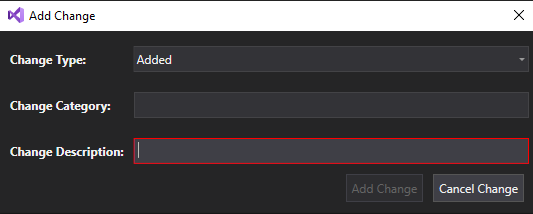
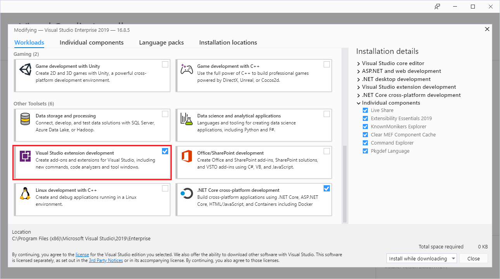

# Changelog Create extension for Visual Studio

`Changelog.VSIX` is a VSIX project that contains the [Visual Studio](https://visualstudio.microsoft.com/vs/) extension helping developers automatically create needed files in the **changes** directory that are used by the [`Changelog Manager`](../Enterwell.CI.Changelog) tool in order to fill out the `CHANGELOG.md` file.

## Table of contents

+ [Installation](#installation)
+ [Usage](#usage)
+ [Configuration file](#configuration-file)
+ [Result / Output](#result--output)
+ [Development](#development)

## Installation

You can get the extension either by downloading and installing it manually from [Visual Studio Marketplace](https://marketplace.visualstudio.com/items?itemName=Enterwell.EnterwellChangelogVsix)



or by searching for it in the Visual Studio Extension Manager.



## Usage
If you're unfamiliar with the `Changelog Manager` tool, it is highly recommended that you read through the `Changelog Manager's` [README](../Enterwell.CI.Changelog/README.md) to understand why would you need this helper Visual Studio extension.

Extension will only show up if you have an open Solution in the editor.

You can trigger the extension by using the `ALT + C` shortcut or by right-clicking on the Solution and selecting the `Add Change to Changelog` option.



One of the following dialog boxes will show up:

+ Changelog configuration ([explained later](#configuration-file)) exists:

  

  `Change Category` is a drop-down list containing all of the valid categories for the changelog that are defined in the aforementioned Changelog configuration.

+ Changelog configuration does not exists:

  

  `Change Category` is a text-box accepting any user input as the change category. (Input can be an empty value and all excess whitespace will be removed).

In both cases `Change Description` is a text-box that can accept any non-empty user input which is used to describe the changes made by the user. Excess whitespace will be removed.

**Add Change** button is disabled if the `Change Description` is invalid (empty), and enabled otherwise.

Extension uses the Visual Studio Status bar in order to log the results:

+ User pressed the **Cancel Change** button:

  

  This is the same behaviour as in the case of an exception. Only the *Reason* part of the message will show the exception message.

+ User pressed the **Add Change** button:

  

## Configuration file
`.changelog.json` is a [JSON file](https://www.json.org/json-en.html) that is optional. Configuration specifies which change categories are allowed in your project. File needs to be located in the same directory alongside the appropriate `CHANGELOG.md` file.

If we wanted to allow only 3 different change categories: `API`, `FE` (Frontend) and `BE` (Backend), the configuration would look like:

```json
{
  "categories": [
    "API",
    "FE",
    "BE"
  ]
}
```

If the configuration exists, application will ignore every change in the **changes** directory that does not concur to it. On the other hand, if the configuration file does not exist, every change will be accepted and written to the `CHANGELOG.md`.

For more features that can be configured using the configuration file, see the [Changelog Manager's README](../Enterwell.CI.Changelog/README.md/#configuration-file).

## Result / Output

If the change was added successfully, **changes** directory is created in the Solution root if one did not exist already, with the correct file and naming used by our [`Changelog Manager`](../Enterwell.CI.Changelog) tool.

## Development

In order to be able to run this code on your machine, you need to have:
1. [Visual Studio 2019](https://visualstudio.microsoft.com/vs/) or newer
2. Visual Studio extension development toolset from the Visual Studio Installer

   